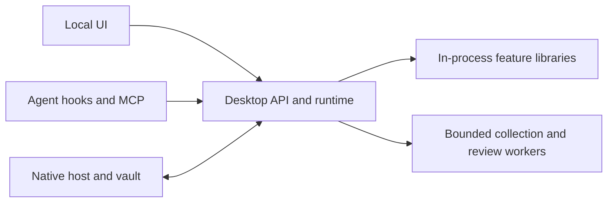

# Components, contracts, and the Desktop host

ADR Desktop is a local command center for people using agents. It should explain and configure features, not become the only place their algorithms can run. We are separating reusable libraries from the host incrementally, while retaining the same process, permission, and storage boundaries.

## Code modules are not services

The native menu-bar host starts one long-lived Python core. The local web UI calls that core over authenticated loopback HTTP. Feature libraries are imported into that process; they do not each start a server or collector.

Existing short-lived processes have specific purposes: a Sensor pass collects supported agents together, a Discovery scan is explicitly requested, hooks/MCP helpers serve harness invocations, and opted-in reviews supervise a local agent CLI. These isolation boundaries remain; this refactor does not add another daemon, database, port, or background scan.

## Ownership

| Area | Reusable component / contract | Desktop or native responsibility |
| --- | --- | --- |
| Activity capture | `Sensor/`: normalized agent events | Schedule one Sensor pass, retain original snapshots, provide scoped search and presentation. |
| AI inventory | `Discovery/`: snapshot and coverage records | Request a bounded scan, persist results, paginate them, explain access limits. Inventory is not prevention. |
| Artifact intelligence | `Protection/`: offline artifact API v1 | Supply the reviewed baseline/custom feed, establish artifact identity, authorize imports, publish policy, enforce decisions, and display findings. |
| File protection | File-policy extraction is tracked separately | Harness adapters, trust resolution, approvals, guarded execution, and closed deny reasons stay host responsibilities. |
| Security reviews | Review-service extraction is tracked separately | Explicit provider/data-sharing consent, budgets, storage, credential checks, CLI isolation, and user-visible findings. These reviews are not the full `Detection/` benchmark pipeline. |
| Credentials | Native operation boundary plus a future metadata/coordinator interface | Swift owns secret entry, encrypted values, credential-backed operations, and output filtering. Python handles metadata, grants, policy, and audit—not a raw-value retrieval API. |
| History and projections | Sensor/Discovery artifacts and future query-service interfaces | One shared profile/database, stable IDs, immutable captures, derived indexes, retention, and authorization. |

The first extracted implementation is the artifact engine. Other rows explicitly describe current ownership or planned work; they are not claims that every feature has already been separated.

## Contributor-facing contract

The first stable library entry point is `adr_protection.api_v1`. It accepts supplied JSON-shaped data and returns validated data or matches. It does not accept Desktop's `Runtime`, open the profile, discover files, launch processes, call a model, or make network requests.

Its feed and generation schemas retain version 1. A compiled matcher can be reused for many lookups; import and construction do not create background work. See the [Protection contract](../../Protection/README.md#public-contract) for supported functions and compatibility rules.

New components should follow the same pattern:

- Make dependencies explicit through narrow inputs or host ports, not access to the entire Runtime or arbitrary SQL.
- Separate construction from lifecycle work. The host owns startup, recovery, cancellation, and shutdown order.
- Preserve useful uncertainty: configured is not observed enforcement; no match is not safe; a partial/error review is not clean.
- Publish typed inputs/outputs and fixed fixtures before callers depend on them.
- Keep source data and derived views separate. A presentation refactor must not rewrite captures, grants, or credential records.

## What is stable during extraction

The existing `adr-desktop`/`ADRCore` subcommands remain the compatibility façade. Generated plugin commands and the frozen executable identity are security-relevant: adding a wrapper or changing MCP argv can change the trust decision. Library extraction must not silently alter them.

Keep these boundaries unchanged unless a separate, reviewed migration explicitly changes them:

- Owner/browser, agent, and hook authorization; CSRF, Host/Origin checks, and scoped MCP tool sets.
- Native request/response messages and closed errors; secret values remain native.
- `policy.json` and `runtime.json` format 1, the guardian handoff, and existing profile paths.
- Database format 3, independently rebuildable history indexes, session/snapshot IDs, and existing narrow grants.
- The precedence of file denies, artifact matches, approvals, and post-approval rechecks.

There is no universal version number for every boundary. A package version, a feed schema version, a database version, and an application build number describe different things.

## Changing a published interface

The artifact v1 input schemas are intentionally closed. Changing accepted fields, interpretation, enum values, normalization, ordering, digest bytes, or failure behavior requires an explicit compatibility decision and, for incompatible changes, a new contract version. Adding an unrelated new API need not change existing v1 calls.

Every extraction includes old-caller tests, fixed expected outputs, standalone package tests, and frozen-build checks. `adr_desktop.threat_feed` remains a compatibility adapter rather than a duplicate implementation. No database or permission migration is required for this first step.

## Why the prototype was composed this way

Sharing one profile, lifecycle, and permission boundary made it possible to connect capture, hooks, vault use, and session-linked reviews without coordinating separate local services. The trade-off was too much feature logic and setup UI accumulating in Desktop.

We retain the useful runtime model and extract one independently testable responsibility at a time. Setup becomes one user-facing place, while individual feature pages remain focused on viewing activity, managing rules, using credentials, or reviewing findings.

The [development task list](DEVELOPMENT_TASKS.md) tracks what is implemented and what still needs extraction.
